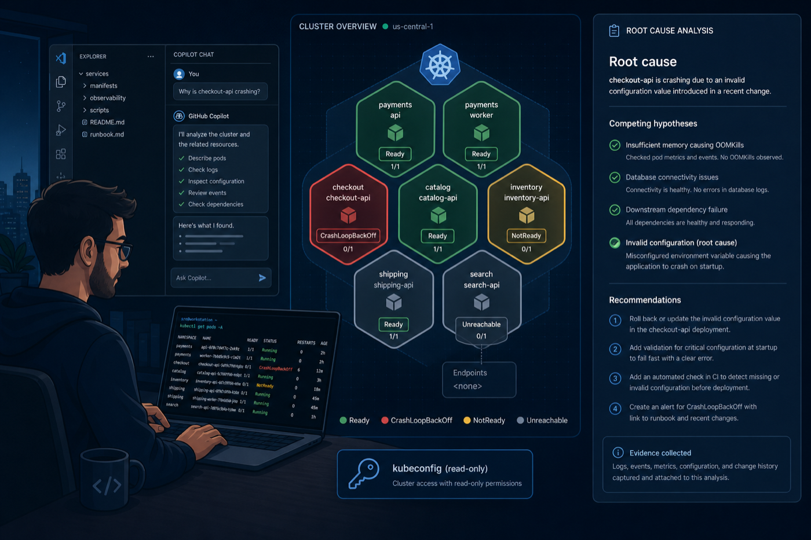
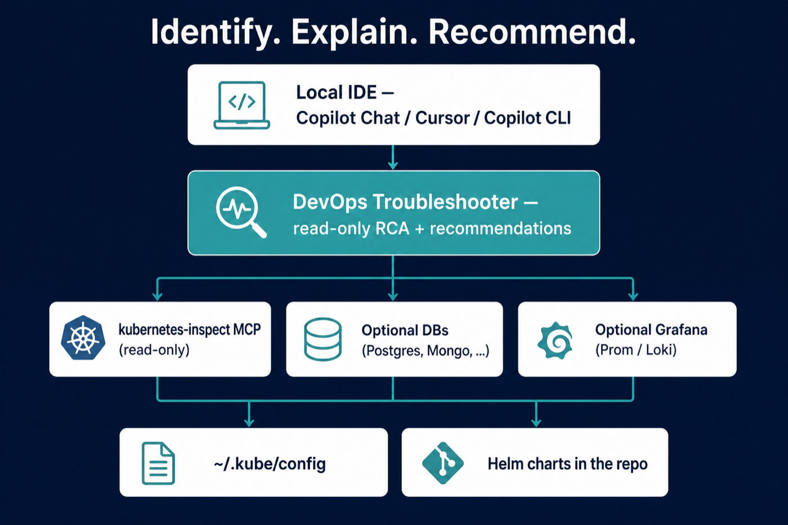
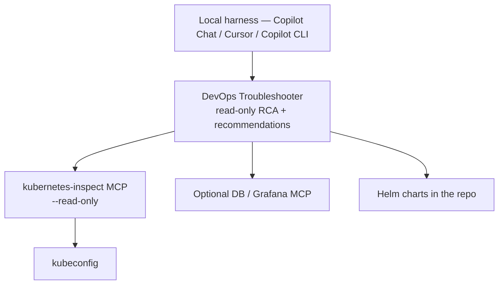
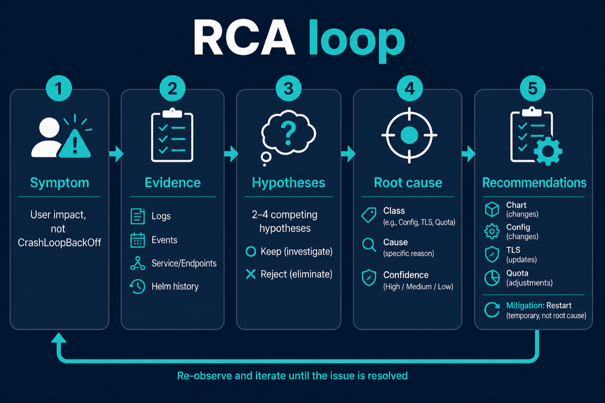

# DevOps Troubleshooter

<p align="center">
  
</p>

<p align="center">
  <strong>Find the issue. Write the RCA. Recommend what would address it — do not apply changes.</strong>
</p>

<p align="center">
  
  
  
</p>

A local agent kit for **GitHub Copilot**, **Cursor**, and **Copilot CLI**. It investigates
Kubernetes incidents using your kubeconfig, workspace Helm charts, and optional
database / Grafana MCP servers.

**CrashLoopBackOff is a symptom.** The agent must name the cause, with competing
hypotheses, a timeline, and **recommendations**. Restart is a mitigation, not a fix.

**Start here:** [User guide](docs/user-guide.md) · [Clusters](docs/clusters.md) · [Token use](docs/token-use.md) · [Init](docs/init.md) · [macOS](docs/macos.md) · [Windows](docs/windows.md)

```bash
./scripts/init.sh                          # asks which MCPs to download
./scripts/init.sh --mcp grafana,postgres,mongodb
./scripts/init.sh --kubeconfig "$HOME/.kube/config:$HOME/.kube/prod.config"
./scripts/init.sh --yes
./tests/e2e.sh                             # kind cluster with planted RCA fixtures
```

```powershell
powershell -ExecutionPolicy Bypass -File .\scripts\init.ps1
powershell -ExecutionPolicy Bypass -File .\scripts\init.ps1 -Mcp grafana,mongodb
powershell -ExecutionPolicy Bypass -File .\scripts\init.ps1 -Kubeconfig "$env:USERPROFILE\.kube\config;$env:USERPROFILE\.kube\prod.config"
```

## How it works

<p align="center">
  
</p>



| Output | Meaning |
|--------|---------|
| **RCA** | Symptom (context + namespace), timeline, hypotheses, evidence ledger, root cause, blast radius |
| **Recommendations** | What would address the cause (chart, config, TLS, quota, git). Not executed. Restart is labeled **mitigation** when mentioned. |
| **Proposed change** | Unified diff against the workspace chart when the cause is in git. Never committed or opened as a PR. |

**Running ≠ Ready ≠ reachable.** Pods can be Running while Service Endpoints are empty.

## RCA loop

<p align="center">
  
</p>

1. **Clarify** — if cluster, namespace, or workload is missing or ambiguous, ask (numbered list). Do not guess.
2. **Pick cluster** — pin kube context; later calls pass `context=`. Helm: `--kube-context`.
3. **Memory** — read **INDEX.md** only; at most one matching record (Symptom + Root Cause).
4. **Symptom** — user impact, not the Kubernetes object name.
5. **Evidence** — small first pass (`pods_log` tail=80, one pod per ReplicaSet). At most two evidence skills.
6. **Hypotheses** — 2–4, each kept or rejected with evidence (ledger ≤8 short rows).
7. **Root cause** — class + cause + confidence. CrashLoopBackOff is not a cause.
8. **Recommendations** — what a human would change in git/chart/TLS/quota. Not applied. Small proposed diff when the fix is in the repo.

## Platform support

| | macOS | Windows | Linux |
|--|-------|---------|-------|
| Init | `./scripts/init.sh` | `.\scripts\init.ps1` | `./scripts/init.sh` |
| MCP binary | `bin/kubernetes-mcp-server` | `bin\kubernetes-mcp-server.exe` | same as macOS |
| npx (optional) | `npx` | **`npx.cmd`** | `npx` |
| Kubeconfig | `~/.kube/config` | `%USERPROFILE%\.kube\config` | `~/.kube/config` |
| Helm | `brew install helm` | `winget install Helm.Helm` | distro / helm.sh |
| Kit tests | `./tests/kit.sh` | `.\tests\kit.ps1` | `./tests/kit.sh` |
| Cluster e2e | `./tests/e2e.sh` | `.\tests\e2e.ps1` | `./tests/e2e.sh` |

Apple Silicon (`darwin/arm64`) and Intel (`darwin/amd64`) are both supported.
Windows amd64 and arm64 are both supported. Use PowerShell on Windows, not `cmd.exe`.

## Quick start

1. macOS/Linux: `./scripts/init.sh`. Windows: `.\scripts\init.ps1`. Discovers IDE/harness, **asks which MCPs to install**, and writes MCP config.
2. Start **kubernetes-inspect** (VS Code: **MCP: List Servers**). Trust it.
3. Agent mode → **DevOps Troubleshooter**, or `/investigate` / `/scan-namespace` / `/from-alert` / `/use-cluster` / `/clarify`.
4. Prompt: `Checkout is failing in staging, namespace payments, after the 14:00 deploy.`

Full walkthrough, good prompts, and RCA shape: **[docs/user-guide.md](docs/user-guide.md)**.
Several kubeconfigs or contexts: **[docs/clusters.md](docs/clusters.md)**.
Keep sessions small: **[docs/token-use.md](docs/token-use.md)**.

Behind a corporate proxy: [docs/proxy-ssl.md](docs/proxy-ssl.md).

## Multiple clusters

See **[docs/clusters.md](docs/clusters.md)** for the full guide.

The agent **lists kube contexts and you pick one**. If `staging` or `prod` matches
more than one name, it **asks** (numbered list) instead of guessing. It does not run
`kubectl config use-context` (that would rewrite your kubeconfig). After you pick,
every inspect call uses `context: <name>` and Helm uses `--kube-context <name>`.

| You have | What to set |
|----------|-------------|
| One kubeconfig, several contexts | Nothing extra. `/use-cluster` or “use context staging”. |
| Several kubeconfig files | Unix: `KUBECONFIG=file1:file2`. Windows: `file1;file2`. Restart **kubernetes-inspect**. |
| Prod must never share a process with staging | Copy `.vscode/mcp.multi-cluster.example.json` — one MCP server per file. |

`./scripts/init.sh --kubeconfig "$HOME/.kube/config:$HOME/.kube/prod.config"` writes `KUBECONFIG` into `.vscode/mcp.env`.

## Token use

See **[docs/token-use.md](docs/token-use.md)**. The **`token-thrift`** skill keeps Copilot/Cursor
from burning the context window:

- Memory: **INDEX.md** one-liners; open at most **one** matching file
- Skills: after classify, **at most two** evidence skills — not every `SKILL.md`
- Logs: one pod per ReplicaSet, `tail=80` first
- RCA: ledger ≤8 short rows; summarize MCP output, never paste full YAML/values
- MCP: Kubernetes inspect only until you opt in (Copilot **128 tools** cap)

Do not start Grafana and every `db-*` server for a CrashLoop.

## Skills

| Skill | When |
|-------|------|
| `rca` | **Every investigation.** Required write-up (ledger + proposed git diff). |
| `token-thrift` | Every session — INDEX-only memory, small logs, no YAML dumps |
| `kube-context` | Multiple clusters/files — list contexts, you pick, pin `context=` |
| `clarify` | Missing or ambiguous cluster / namespace / workload / time — ask, don’t guess |
| `cluster-scan` | Vague “something is wrong in ns X” — severity-tagged findings first |
| `alert-intake` | Pasted Prometheus / Alertmanager / Grafana / PagerDuty alert |
| `k8s-incident` | CrashLoop, ImagePull, OOM, probes, Pending |
| `service-path` | 502s, not Ready, empty Endpoints, selector mismatch |
| `ingress-tls` | Wrong Ingress backend, missing/expired TLS cert, host mismatch |
| `change-correlation` | Helm history, git, GitHub Actions/PRs — what changed |
| `gitops` | Argo Application / Flux Kustomization vs live (OutOfSync, suspended) |
| `saturation` | Pending: quota, PVC, HPA at max, PDB, node pressure |
| `helm-drift` | Live spec ≠ workspace chart |
| `db-evidence` | Logs point at Postgres / MySQL / Oracle / SQL Server / Mongo / … |
| `observability` | Grafana MCP (Prometheus / Loki) |
| `incident-memory` | INDEX.md first; save a short RCA after you confirm |

Copilot Chat: type `/` for **investigate**, **scan-namespace**, **from-alert**, **use-cluster**, **clarify** (`.github/prompts/`).

## Test it (e2e)

No Copilot required for the automated path. You need Docker + [kind](https://kind.sigs.k8s.io/) for the cluster half.

**macOS / Linux**

```bash
./tests/kit.sh
./tests/e2e.sh
./tests/e2e.sh --keep-cluster
./tests/e2e.sh --kit-only
```

**Windows (PowerShell)**

```powershell
powershell -ExecutionPolicy Bypass -File .\tests\kit.ps1
powershell -ExecutionPolicy Bypass -File .\tests\e2e.ps1 -KeepCluster
powershell -ExecutionPolicy Bypass -File .\tests\e2e.ps1 -KitOnly
```

Fixtures in `tests/fixtures/` (namespace `dto-e2e`):

| Workload | Expected root cause |
|----------|---------------------|
| `crashloop` | Exit 1; logs `CONFIG_ERROR: missing PAYMENTS_DSN` |
| `not-ready` | Readiness TCP probe on closed port 9999 |
| `mismatch` | Service `app=payments` vs pods `app=payments-api` (empty Endpoints) |
| Ingress `payments` | Backend `does-not-exist`; TLS secret missing |
| Helm `dto-hist` | Two revisions for `helm history` |
| `pending-quota` | ResourceQuota `tiny` pods 3/3 — new replica cannot schedule |

Then ask Copilot: `Something is wrong in namespace dto-e2e. Investigate all workloads.`
Pick kube context `kind-dto-e2e` if the agent lists several (`/use-cluster`).

```bash
kind delete cluster --name dto-e2e
```

CI runs kit tests on Ubuntu, macOS, and Windows, plus the kind cluster job on Ubuntu (see `.github/workflows/e2e.yml`).

## Docs

| Doc | Contents |
|-----|----------|
| [User guide](docs/user-guide.md) | Daily use, prompts, RCA format, demo cluster |
| [Clusters](docs/clusters.md) | Multiple kubeconfigs / contexts; when the agent asks |
| [Token use](docs/token-use.md) | Keep investigations small (INDEX, tails, skill budget) |
| [Init](docs/init.md) | OS / IDE / harness discovery |
| [macOS](docs/macos.md) | Homebrew, Apple Silicon, kind/Colima |
| [Windows](docs/windows.md) | PowerShell, `.exe`, `npx.cmd` |
| [Copilot + VS Code](docs/copilot-vscode.md) | Agent mode, MCP, optional DB/Grafana |
| [Proxy / SSL](docs/proxy-ssl.md) | Corporate intercepting proxies |
| [User-level install](docs/user-install.md) | `~/.copilot` for every workspace |

## Layout

```
.github/agents/          devops-troubleshooter.agent.md
.github/skills/          rca, token-thrift, clarify, kube-context, cluster-scan, …
.github/prompts/         investigate, scan-namespace, from-alert, use-cluster, clarify
.github/memory/          INDEX + example RCAs + _TEMPLATE.md
deploy/                  rbac-troubleshooter-view.yaml (read-only SA)
.github/workflows/e2e.yml
.vscode/mcp.json         Default MCP (npx, inspect-only). init overwrites locally with binaries
.vscode/mcp.*.json       Binary / Windows / DB / Grafana / optional remediator variants
.vscode/mcp.env.example  Template — copy to mcp.env (gitignored)
.vscode/mcp.multi-cluster.example.json  Optional: one MCP server per kubeconfig file
scripts/init.sh|.ps1     Discover OS, IDE, harness; ask which MCPs; write config
scripts/setup.sh|.ps1    Download MCP binaries only
tests/                   kit.sh + kit.ps1, e2e.sh + e2e.ps1, kind fixtures
docs/                    user-guide, clusters, token-use, init, macos, windows, …
docs/images/             README diagrams
LICENSE                  MIT
```

`init` writes machine-specific files that **must not** be committed: `.mcp.json`, `.cursor/mcp.json`, `.github/mcp.json`, `.vscode/mcp.env`, `.devops-troubleshooter-init.json`, and `bin/`. The committed default is `.vscode/mcp.json` (npx, inspect-only) plus `.mcp.json.example`.

Npx without binaries (Node 18+): keep `.vscode/mcp.json` as committed. On Windows copy `.vscode/mcp.npx.windows.json` over it (`npx.cmd`).

## Security

- Troubleshooter: read-only Kubernetes (`--read-only`). No `pods_exec`. Recommendations only — never apply.
- Prefer a `view` kubeconfig. Apply [deploy/rbac-troubleshooter-view.yaml](deploy/rbac-troubleshooter-view.yaml) for a read-only ServiceAccount. DB users: SELECT / read-only. Mongo: `--readOnly`.
- Grafana MCP (optional): `--disable-write`, Prometheus + Loki tools only.
- Do not commit `.vscode/mcp.env` (gitignored). Copy it from `mcp.env.example`. Agents redact secrets in output.

## MCP servers

Default **download + use** is Kubernetes inspect only. Grafana and databases are optional so you stay under Copilot’s **128 tools** cap. `init` asks which optional servers to install.

| Server | How it is installed | How you use it |
|--------|---------------------|----------------|
| `kubernetes-inspect` | `init` downloads [kubernetes-mcp-server](https://github.com/containers/kubernetes-mcp-server) v0.0.66 for darwin/linux/windows × amd64/arm64. Fallback: `npx` / Windows `npx.cmd`. | Started automatically from `.vscode/mcp.json`. `--read-only --toolsets core,config,helm`. |
| `grafana` | No binary. `uvx mcp-grafana` downloads on first start (`brew install uv` / Windows uv installer). | Pick Grafana in the init prompt, or merge `.vscode/mcp.grafana.json`. Needs `GRAFANA_URL` + `GRAFANA_SERVICE_ACCOUNT_TOKEN`. `--disable-write`, tools `datasource,prometheus,loki`. |
| `db-postgres` / `db-mysql` / `db-oracle` / `db-mssql` / `db-sqlite` / `db-clickhouse` / `db-elasticsearch` / `db-neo4j` / `db-snowflake` | `init` downloads [mcp-toolbox](https://github.com/googleapis/mcp-toolbox) v1.9.0 when you pick a SQL-style DB. **No linux/arm64 binary** — use npx. | Pick engines in the init prompt, or copy **only the servers you need** from `.vscode/mcp.databases*.json`. Read-only DB users. |
| `db-mongodb` | `npx mongodb-mcp-server@latest --readOnly` (Windows: `npx.cmd`). No extra binary. | Pick mongodb in init, or set `MDB_MCP_CONNECTION_STRING` in `mcp.env`. Always `--readOnly`. |

Do not enable every server at once. The leftover remediator agent is not wired; merge `.vscode/mcp.remediate.json` only if you explicitly want it.

## What this kit does not do

- Apply remediations or mutate the cluster (recommendations only)
- Custom MCP servers
- Helm install / upgrade / uninstall / rollback from the troubleshooter
- SQL writes, Mongo writes, `kubectl apply`, `kubectl exec`
- Cloud Copilot on github.com (no laptop kubeconfig)

## Known limitations

- Automated e2e proves kubectl + MCP can **see** the fixtures. It does not invoke Copilot to write the RCA — do that in Agent mode against `dto-e2e`.
- `gitops` needs Argo CD / Flux CRDs in the cluster. kind fixtures do not install them.
- Helm history uses the **Helm CLI** on PATH via allowlisted `execute` (MCP Helm has no `helm_history`).
- There is no `--install-into` other repos; copy `.github/` + MCP config, or use [user-level install](docs/user-install.md).
- Cluster e2e CI runs on Ubuntu. Windows/macOS CI runs kit contract tests.

## License

[MIT](LICENSE)
